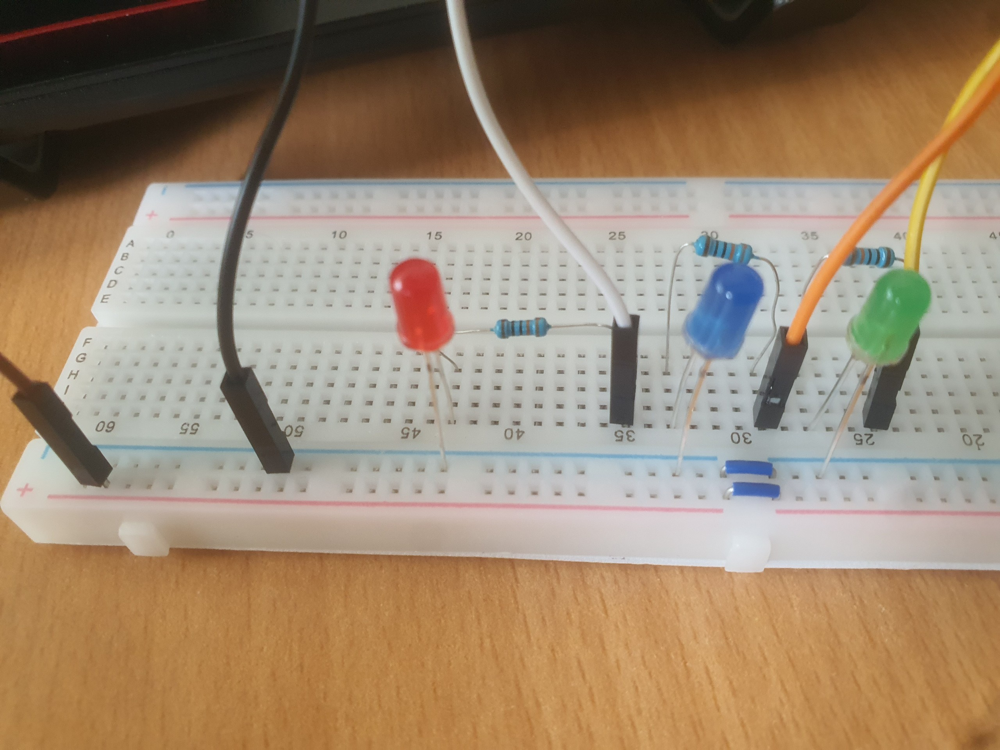

# Raspberry Pi 4B: LED Sequence with Push Button

This project demonstrates how to use a push button to control a sequence of LEDs on a Raspberry Pi 4B. Each press of the button will light up the next LED in the sequence.

## Table of Contents
- [Setup](#setup)
- [Components](#components)
- [Wiring](#wiring)
- [Installation](#installation)
- [Usage](#usage)
- [License](#license)
- [Contact](#contact)

## Setup
### Components
- Raspberry Pi 4B (other models should work as well)
- 3 LEDs (Red, Blue, Green)
- 1 4-leg Push Button
- 4 330 ohm resistors (for the LEDs and button)
- 1 10k ohm resistor (for the push button)
- Breadboard and jumper wires

### Wiring
Refer to the circuit diagram and photos in the `docs/` directory.

#### Circuit Diagram


#### Circuit Photos





- Connect each LED to a GPIO pin through a 330 ohm resistor (e.g., GPIO 17, 27, and 22).
- Connect one leg of the push button to a GPIO pin (e.g., GPIO 26), another leg to ground through a 10k resistor, one leg for 3.5V source, and the remaining legs as needed for stability.

## Installation
### Prerequisites
- Raspberry Pi OS installed on your Raspberry Pi. You can download it from [here](https://www.raspberrypi.org/software/).

### Steps
1. Clone this repository:
    ```bash
    git clone https://github.com/tuanlanvidai/Raspberry-Pi-4B-LED-Sequence-with-Push-Button.git
    ```
2. Install required Python libraries:
    - For Python 2:
      ```bash
      sudo apt-get update
      sudo apt-get -y install python-rpi.gpio
      ```
    - For Python 3:
      ```bash
      sudo apt-get update
      sudo apt-get -y install python3-rpi.gpio
      ```

## Usage
### Using the Command Line
1. Navigate to the `src/` directory:
    ```bash
    cd Raspberry-Pi-4B-LED-Sequence-with-Push-Button/src
    ```
2. Run the Python script:
    ```bash
    Rpi_Button_Led_sequence.py
    ```
3. Press the button to cycle through the LEDs.

### Using Thonny IDE
1. Open Thonny IDE on your Raspberry Pi.
2. Open the `Rpi_Button_Led_sequence.py` file from the `src` directory.
3. Click the `Run` button (or press `F5`) to execute the script.
4. Press the button to cycle through the LEDs.

## License
This project is licensed under the MIT License - see the [LICENSE](LICENSE) file for details.

## Contact
If you have any questions, feel free to contact me at [lantruongtuan333@gmail.com](mailto:lantruongtuan333@gmail.com).
